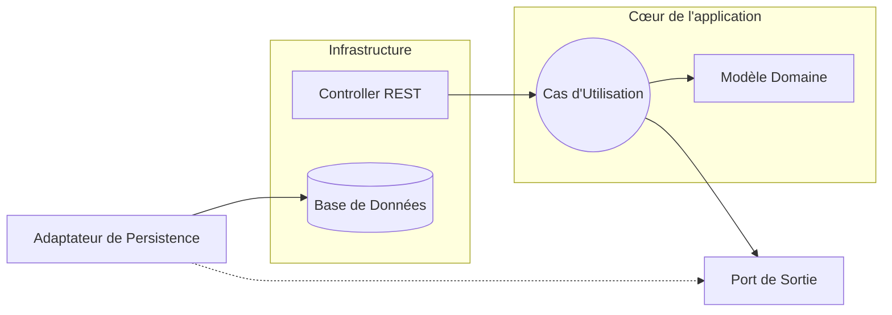

# Refactorisation Clean Architecture : Module Projet

Ce document résume la transition effectuée sur le module `Project` pour passer d'une architecture en couches classique à une **Clean Architecture** (aussi appelée Architecture Hexagonale ou Ports & Adapters).

## 🎯 Objectif et Philosophie

L'objectif principal est de **protéger la logique métier** (le cœur de l'application) des détails techniques (base de données, frameworks web, API externes). 

Dans la Clean Architecture, le code métier ne doit dépendre de rien. C'est l'extérieur (Infrastructure) qui dépend de l'intérieur (Domaine).

## 🏗️ Avant vs Après

### Architecture Précédente (Layered)
L'architecture classique créait un couplage fort :
1.  **Controller** (`ProjectController`) dépendait directement du Service.
2.  **Service** (`ProjectService`) dépendait directement du Repository JPA.
3.  **Repository** (`ProjectRepository`) manipulait directement l'Entité JPA (`Project`).

❌ **Problème** : Si on change de base de données ou de framework, tout doit changer. Le métier est pollué par des annotations `@Entity`, `@Column`, etc.

### Nouvelle Architecture (Clean / Hexagonale)
Nous avons inversé les dépendances en séparant les responsabilités en cercles concentriques.

#### 1. Le Domaine (Le Cœur 💛)
C'est la vérité absolue de l'application. Il contient les règles métier pures.
*   **Fichier** : `fr.limayrac.demo.project.domain.model.Project`
*   **Caractéristiques** : C'est une simple classe Java (POJO). **Aucune annotation JPA**, aucune dépendance Spring. Juste des données et des comportements métier.

#### 2. La Couche Application (Les Cas d'Utilisation 🧠)
Elle orchestre les actions métier en utilisant le Domaine.
*   **Ports (Interfaces)** :
    *   **In (Entrée)** : `ProjectUseCase` définit ce que l'application *peut faire* (créer un projet, lister, supprimer).
    *   **Out (Sortie)** : `ProjectPort` définit ce dont l'application *a besoin* pour fonctionner (sauvegarder, trouver).
*   **Service** : `ProjectServiceImpl` implémente `ProjectUseCase`. Il contient la logique applicative mais ne sait pas *où* sont stockées les données.

#### 3. L'Infrastructure (Les Détails Techniques 🔌)
C'est tout ce qui connecte notre application au monde extérieur.
*   **Persistence (Base de Données)** :
    *   `ProjectEntity` : L'ancienne classe `Project` est devenue `ProjectEntity`. Elle est dédiée à la base de données (H2/Postgres) avec toutes les annotations JPA.
    *   `ProjectAdapter` : Il implémente `ProjectPort`. Il fait la traduction entre le monde du Domaine (`Project`) et le monde de la Base de Données (`ProjectEntity`).
*   **Web (API REST)** :
    *   `ProjectController` : Il appelle le `ProjectUseCase`. Il ne manipule plus d'entités JPA, mais des DTOs (`ProjectResponse`, `ProjectCreateRequest`).

## 🔄 Concrètement, qu'est-ce qui a changé ?

| Concept | Avant | Maintenant |
| :--- | :--- | :--- |
| **Entité** | Une seule classe `Project` faisait tout (Métier + BDD). | Séparation en deux : `Project` (Métier) et `ProjectEntity` (BDD). |
| **Dépendances** | Service dépendait de Repository. | Service dépend d'une interface `ProjectPort`. |
| **Logique** | Mélangée avec le framework. | Pure et isolée dans le Domaine/Service. |
| **Tests** | Difficiles sans base de données. | Faciles ! On peut tester le métier sans charger Spring ou une BDD. |

## 🧩 Interopérabilité (Legacy)

Le module `Task` n'a pas encore été migré. Pour qu'il continue de fonctionner :
*   Il utilise désormais `ProjectEntity` pour ses relations JPA (`@ManyToOne`).
*   Le reste de l'application utilise le nouveau modèle `Project`.
*   Cela prouve que l'on peut migrer progressivement module par module !

## 📊 Schéma Simplifié

